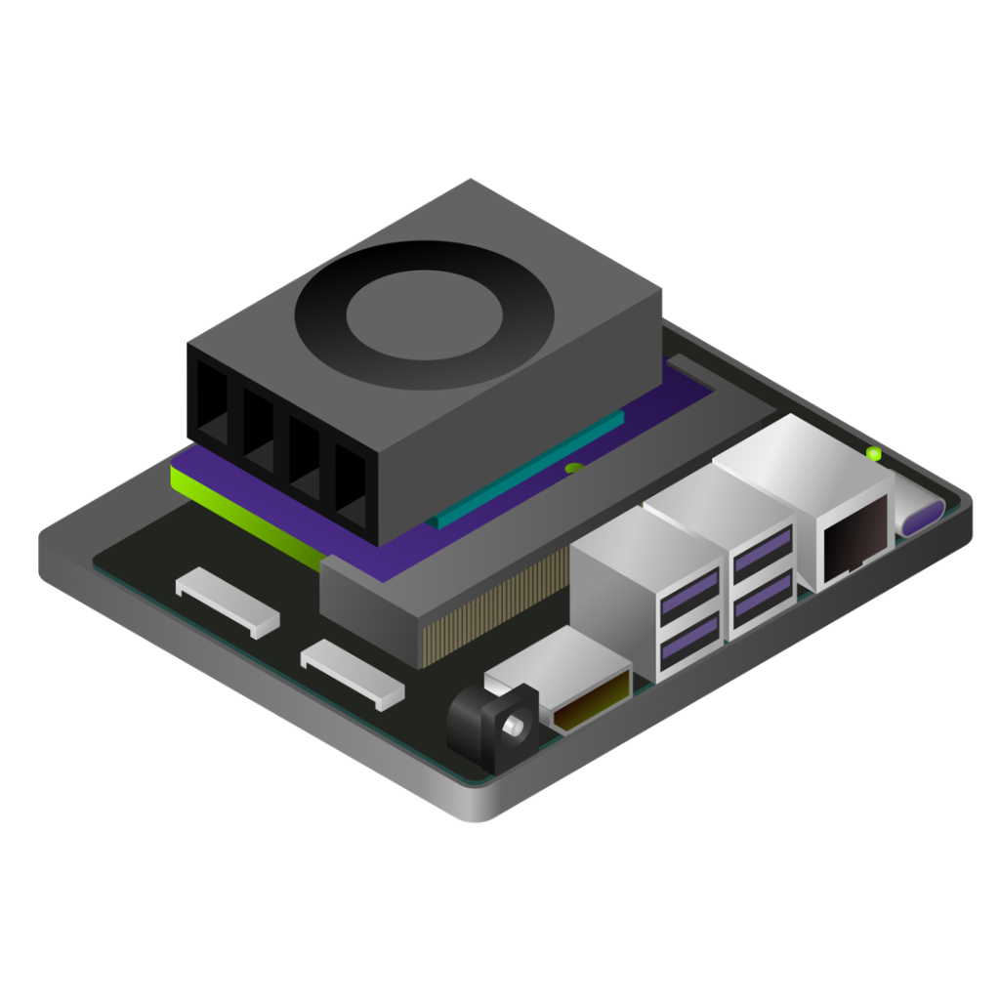

  

# office-hours

If you’re a robotics enthusiast or computer vision engineer who loves tinkering with edge devices, the Jetson AI Research Lab Call is the community space you’ve been looking for.

This is an open, collaborative call where Jetson enthusiasts gather to:

Showcase: Share novel projects and real-world applications.
Problem-Solve: Break down technical issues and implementation hurdles.
Brainstorm: Discuss the future of edge AI, computer vision, and agent deployment.
Hire or Be Hired: Whether you are looking to hire or looking to be hired this is the hub from aspiring physical AI or embodied AI start their career journey

## When
Every 2nd Tuesday of the month.
Times: 9:00 AM PST / 12:00 PM EST / 5:00 PM GMT
 Call link: [Teams meeting](https://teams.microsoft.com/l/meetup-join/19%3ameeting_ZWUwNTIxYmQtNGJmZC00MDA1LTkzN2MtYmFmMzJjZWUxNDFh%40thread.v2/0?context=%7b%22Tid%22%3a%2243083d15-7273-40c1-b7db-39efd9ccc17a%22%2c%22Oid%22%3a%223e5863c5-26ea-489e-a546-cdc43df532ed%22%7d)

<meta property="og:image" content="https://jetson-ai-lab.github.io/office-hours/assets/icon.png"> [Add to calendar](calendar.ics)

[Jetson AI Lab Nvidia site](https://www.jetson-ai-lab.com/research/)
